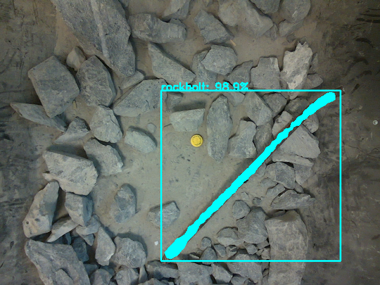
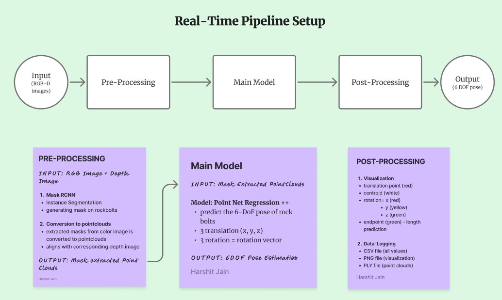
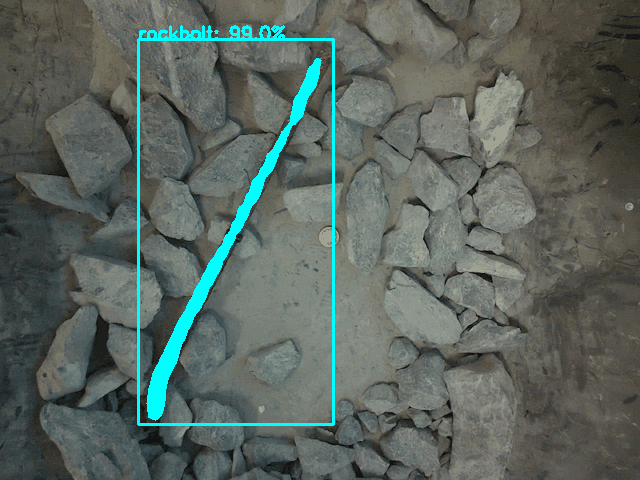
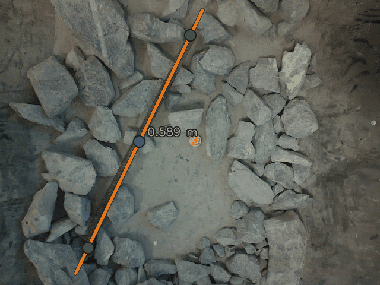
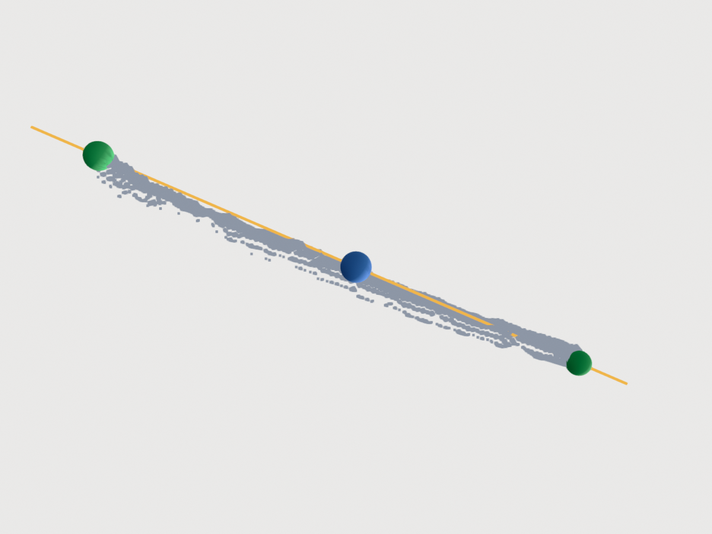
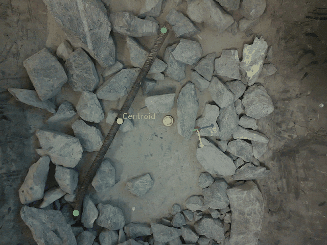

# Rockbolt 6-DoF Pose Estimation from RGB-D

**Industry project with ABB, Umea University, Sweden.** Developed Mar 2025 to Jul 2025. Published to GitHub Sep 2026.

Finding discarded rock bolts in a cluttered rock bed and estimating where they are in 3D, so a robot arm can pick them off a mine conveyor. Position lands within 0.055 m of hand-measured ground truth.

This repository is the pose pipeline I built end to end: Mask R-CNN instance segmentation of the bolt, point-cloud reconstruction from aligned depth and camera intrinsics, PCA recovery of the bolt axis and endpoints, and a learned pose regression on the reconstructed cloud. It was one of two pose pipelines developed in parallel inside a 10-person project, the other being a teammate's YOLOv8 plus PCA approach that mine was compared against.



[Full end-to-end demo: segmentation, point-cloud extraction and grasping in RViz](https://drive.google.com/file/d/1kiQsx3HRyf8_AB6DHOmRB_qQmx1-UGZ5/view?usp=sharing). The ROS2 integration and the RViz grasp-feasibility check in that video were joint work with a teammate, and that code is not part of this repository.

## What this does

Rock bolts are steel anchors that work loose from the rock they were driven into and end up riding a conveyor mixed in with ore. They have to be pulled before the ore goes downstream, and doing it by hand is slow and unpleasant.

The hard part is not spotting the bolt. It is that a bolt is a long thin object lying at an arbitrary angle, often partly buried, and an arm needs its position in metres rather than a box in pixels. So the pipeline goes from a single RGB-D frame to a 3D pose in four stages:

1. Segment the bolt at pixel level with a fine-tuned Mask R-CNN.
2. Back-project the masked pixels through the camera intrinsics into a point cloud.
3. Recover the bolt axis, its two endpoints and its length from that cloud with PCA.
4. Regress a 6-DoF pose from the cloud with a network trained on synthetic bolts.



## Results

| Metric | Value | Measured on |
|---|---|---|
| Mean bolt centroid error | 0.055 m | 10 hand-measured frames |
| Median centroid error | 0.041 m | same 10 frames |
| Worst case | 0.153 m | same 10 frames |
| Segmentation confidence | 95.5% to 98.9% per instance | inference sequence |
| Bolt length recovered | 0.14 m to 0.65 m | inference sequence, PCA principal axis |

The centroid error is the distance between the hand-measured bolt centre and the midpoint of the two endpoints PCA recovers from the segmented cloud, averaged over the frames. Ground truth was measured with a ruler in the camera frame and ships as `docs/results/ground_truth.csv`, so `src/evaluate.py` reproduces the figure directly rather than leaving you to take it on trust.

The error is a property of segmentation, depth back-projection and PCA rather than of the learned regression, whose translation output sits 0.10 m to 0.35 m away from that centroid across the same instances. Running `evaluate.py --estimate translation` scores the network instead of the geometry, which makes the distinction something you can check in one command.

The two short lengths in that range, 0.139 m and 0.205 m, come from a frame where the bolt is mostly buried and only a corner segment is visible. Partial visibility, not measurement error.

Every figure below is generated from the recorded run output, not drawn for the README. The lengths and midpoints in them match their rows in the results CSV exactly.

## How it works

### Instance segmentation

Detectron2 Mask R-CNN, ResNet-50 FPN, COCO-pretrained and fine-tuned to a single `rockbolt` class on 1000+ RGB-D frames collected by the team. 1000 iterations, base LR 0.00025, 2 images per batch, 64 ROIs per image, input fixed at 640.

Instance segmentation rather than detection is the whole point. A bounding box around a diagonal bolt is mostly rock, and back-projecting a box would drag that rock into the point cloud and pull the recovered axis with it. Each mask then has to clear a 0.95 score, an explicit IoU 0.7 check against masks already accepted, and a 5x5 morphological opening that removes the speckle which would otherwise become stray 3D points.



### Mask to point cloud

Every masked pixel with depth above 1 mm is back-projected through the pinhole model, so a pixel at (u, v) with depth z lands at ((u - cx) z / fx, (v - cy) z / fy, z). The mask is dilated 3x3 first, which recovers the boundary pixels segmentation tends to shave off a thin object.

Depth scale and intrinsics are dataset-specific and turned out to be the most fragile part of the pipeline. The training and inference splits came from different cameras with different depth formats, so `src/config.py` holds both sets of intrinsics and both depth conventions in one place. The training-split depth maps are 8-bit normalised exports, where a pixel value is a fraction of the range the export covered rather than a distance, and reading them as raw millimetres put a rock bed 0.9 m away at 107 m. Choosing the scale by depth dtype instead maps a representative training frame to a median of 0.835 m, against the 0.85 m to 0.91 m the inference pipeline measures independently from real depth. Two cameras, two formats, medians agreeing within a few centimetres.

### Axis, endpoints and length

A bolt is long and thin, so the direction it points is the direction its points spread out the most. The eigenvector of largest eigenvalue of the mean-centred covariance is the bolt axis. Projecting every point onto that axis gives the two extremes as the ends, their separation as the length, and their midpoint as the geometric centroid.

This is deterministic geometry with nothing learned in it, and it degrades gracefully: an occluded bolt yields a short length rather than a wrong axis. It is the stage the accurate position comes from.





In both figures amber is the principal axis, green are the two recovered endpoints, and blue is their midpoint. The 3D render reports a length of 0.578 m and a midpoint at (0.1154, 0.0923, 0.8834), the same values recorded for that instance during inference.

PCA here recovers endpoints and length. It is not the pose estimator, which matters because the teammate's parallel pipeline used PCA for pose itself.

### Pose regression

A PointNet-style encoder: a shared per-point MLP of 3 to 64 to 128 to 256 with ReLU, BatchNorm and dropout at each stage, a global max pool to a 256-vector, then a quaternion head with L2 normalisation and a translation head. Because the same MLP is applied to every point and the points are then reduced by a max, the output does not depend on the order the points arrive in, which is what makes it usable on a raw cloud.

Real frames carry no 6-DoF ground truth to learn from, so training data is procedural: 500 clouds, each a 2048-point cylinder of length 0.3 to 1.0 m with radial jitter, half given a sinusoidal bend to stand in for bolts deformed in service, plus 30 percent extra points scattered nearby, since a real mask is never clean. Random pose per cloud, Euler angles within plus or minus 45 degrees, translation within plus or minus 0.2 m.

At inference the cloud is recentred on the PCA midpoint, which matches how the synthetic clouds were framed, 1024 points are sampled, and the midpoint is added back afterwards to return the prediction to the camera frame.

## Running it

Python 3.9. Detectron2 builds against the installed torch, so it goes in after the requirements file.

```bash
conda create -n abb_rockbolt_env python=3.9 -y
conda activate abb_rockbolt_env
pip install -r requirements.txt
pip install git+https://github.com/facebookresearch/detectron2.git
```

Point the pipeline at your data and output directories. `src/config.py` documents the layout these two roots are expected to have, and holds every path, camera parameter and hyperparameter in one place.

```bash
export ROCKBOLT_DATA=/path/to/dataset
export ROCKBOLT_OUTPUT=/path/to/outputs
```

Generate the synthetic clouds and train:

```bash
python src/generate_synthetic_data.py
python src/train_pipeline.py
```

Run the trained models over an RGB-D sequence. This writes RGB overlays with mask, box and confidence, one `.ply` per detected instance, and a CSV of translation, quaternion, endpoints and length:

```bash
python src/infer_pipeline.py
```

Score position estimates against measured ground truth. The CSV is `filename,x,y,z` with an optional `instance` column, positions in metres in the camera frame. Add `--estimate translation` to score the network instead of the PCA centroid, `--out` to write per-instance errors:

```bash
python src/evaluate.py --predictions outputs/realtime/pose_results.csv \
                       --ground-truth docs/results/ground_truth.csv
```

Bring separate RGB, depth and label folders into a shared frame numbering:

```bash
python scripts/renumber_dataset.py <source_folder> <destination_folder>
```

No datasets, model weights or rosbags ship with this repository. The frames were collected on sponsor-supplied equipment, and checkpoints belong somewhere other than git.

## Limitations

The rotation half of the 6-DoF estimate is not usable as it stands. Every predicted quaternion across the inference set has Qw between 0.93 and 0.99, so all 14 predictions sit near the identity: a regression head collapsed toward the mean of its training distribution. Two causes are visible in the code. The loss applies MSE to raw quaternion components, which ignores that q and -q are the same rotation, so a correct answer of the wrong sign is punished as hard as a wrong one. And the synthetic pose distribution is symmetric about the identity, which makes predicting the mean a low-loss strategy on its own.



That is the pipeline's own overlay. The green endpoints and white centroid are the PCA quantities and land on the bolt. The axis triad is the regressed rotation drawn at the regressed translation, which is why it floats in empty space near the frame edge. Comparing it against the PCA loop above is the gap in the results section, shown rather than asserted.

The rest:

- The pose network trains entirely on procedural synthetic cylinders. No real annotated 6-DoF ground truth existed to train on.
- The position accuracy that holds up comes from segmentation, depth back-projection and PCA, not from the learned regression.
- Evaluation is 10 frames with manual ground truth. Enough to report an error figure, not enough for a robustness claim.
- Training and inference used different cameras and different depth formats, so their clouds are not directly comparable. The training-split depth maps are normalised exports, so no single global constant recovers true metric depth from them, and every metric quoted above comes from the inference path.
- Training augmentation was Detectron2's defaults, a shortest-edge resize and a horizontal flip. There is an Albumentations chain in the file that was never wired into the training loader, and it would have moved pixels without moving the masks and boxes with them. It is kept in place with a comment rather than deleted.
- Inference ran at Detectron2's default NMS threshold. Overlap removal came from the explicit IoU 0.7 check.
- Segmentation was fine-tuned on one bolt class in one scene type. Nothing here demonstrates cross-site generalisation.
- The RViz check in the demo verified whether a grasp was reachable. It is not a grasp planner.

## Next step

Replacing the synthetic training set with real clouds carrying measured 6-DoF ground truth, paired with a rotation-aware loss such as geodesic distance or MSE on the absolute dot product. That is the fix for the near-identity rotation, and it is the difference between a pipeline that localises bolts and one that can orient a gripper to them.

## License

MIT. See [LICENSE](LICENSE).
